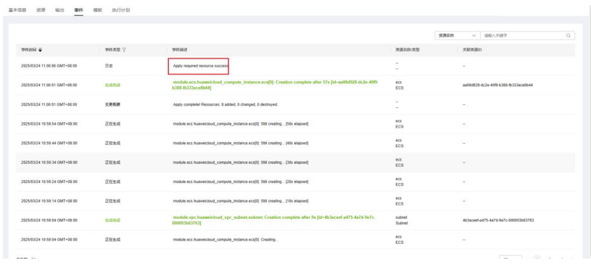
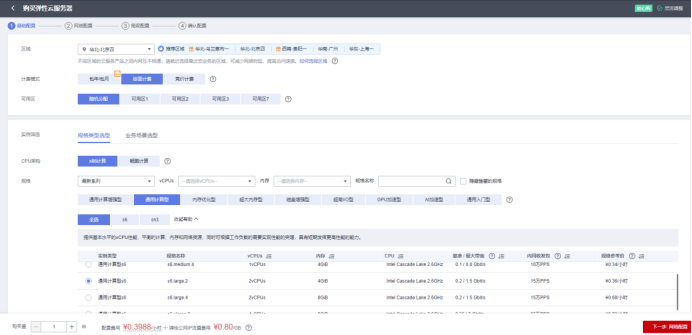
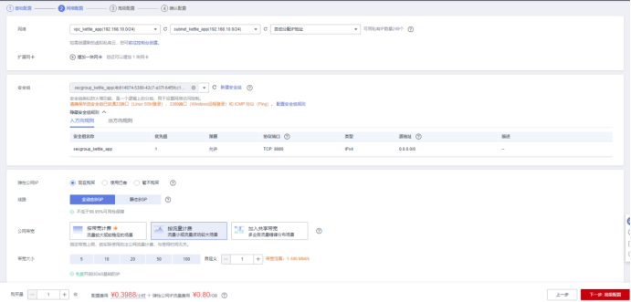
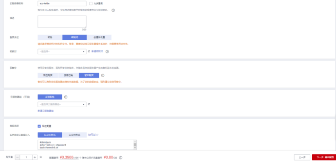
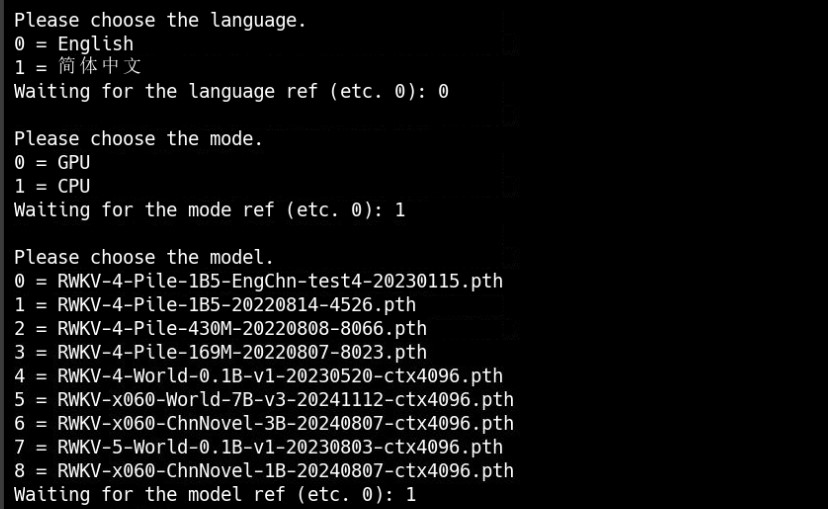

# RWKV 使用指南

# 一、商品链接

[RWKV-大语言模型](https://marketplace.huaweicloud.com/contents/99586bca-3cb8-43c3-b086-ef355db52e67?ticket=ST-882175-yV6NxeggGxKKfrq9N4pmqDbP-sso#productid=OFFI1121280243411267584)

# 二、商品说明

RWKV是一种结合RNN高效推理与Transformer并行训练优势的新型架构，通过线性复杂度的WKV机制替代传统注意力，显著降低长序列处理的计算开销。其支持无限上下文长度和恒定显存占用，适用于文本生成、图像分类等场景，且兼容边缘设备。
本商品通过 鲲鹏服务器 + Huawei Cloud EulerOS 2.0 64bit 进行安装部署。

# 三、商品购买

您可以在云商店搜索 **RWKV-大语言模型**。

其中，地域、规格、推荐配置使用默认，购买方式根据您的需求选择按需/按月/按年，短期使用推荐按需，长期使用推荐按月/按年，确认配置后点击“立即购买”。

##3.1 商品支持自定义 ECS 购买，具体见章节 4.1.1
##3.2 使用 RFS 模板直接部署

必填项填写后，点击 下一步


创建直接计划后，点击 确定


如下图“Apply required resource success. ”即为资源创建完成

# 商品资源配置

商品支持 **ECS 控制台配置**，下面对资源配置的方式进行介绍。

## <a id="ECS控制台配置"></a>ECS 控制台配置

### 准备工作

在使用ECS控制台配置前，需要您提前配置好 **安全组规则**。

> **安全组规则的配置如下：**
> - 入方向规则放通 CloudShell 连接实例使用的端口 `22`，以便在控制台登录调试
> - 出方向规则一键放通

### 创建ECS

前提工作准备好后，选择 ECS 控制台配置跳转到购买 ECS 页面，ECS 资源的配置如下图所示：





> **值得注意的是：**
> - VPC 您可以自行创建
> - 安全组选择 [**准备工作**](#准备工作) 中配置的安全组；
> - 弹性公网IP选择现在购买，推荐选择“按流量计费”，带宽大小可设置为5Mbit/s；
> - 高级配置需要在高级选项支持注入自定义数据，所以登录凭证不能选择“密码”，选择创建后设置；
> - 其余默认或按规则填写即可。

# 商品使用

## RWKV 使用

### CPU推理
登录到服务器上运行
```bash
conda activate py39
```
在/opt/ChatRWKV下执行
```bash
python v2/app.py 
```
运行之后先选择语言，然后选择要使用的处理
器，CPU推理就选择CPU，最后选择需要进行推理的模型。


### 参考文档

[RWKV参考文档](https://github.com/BlinkDL/ChatRWKV)